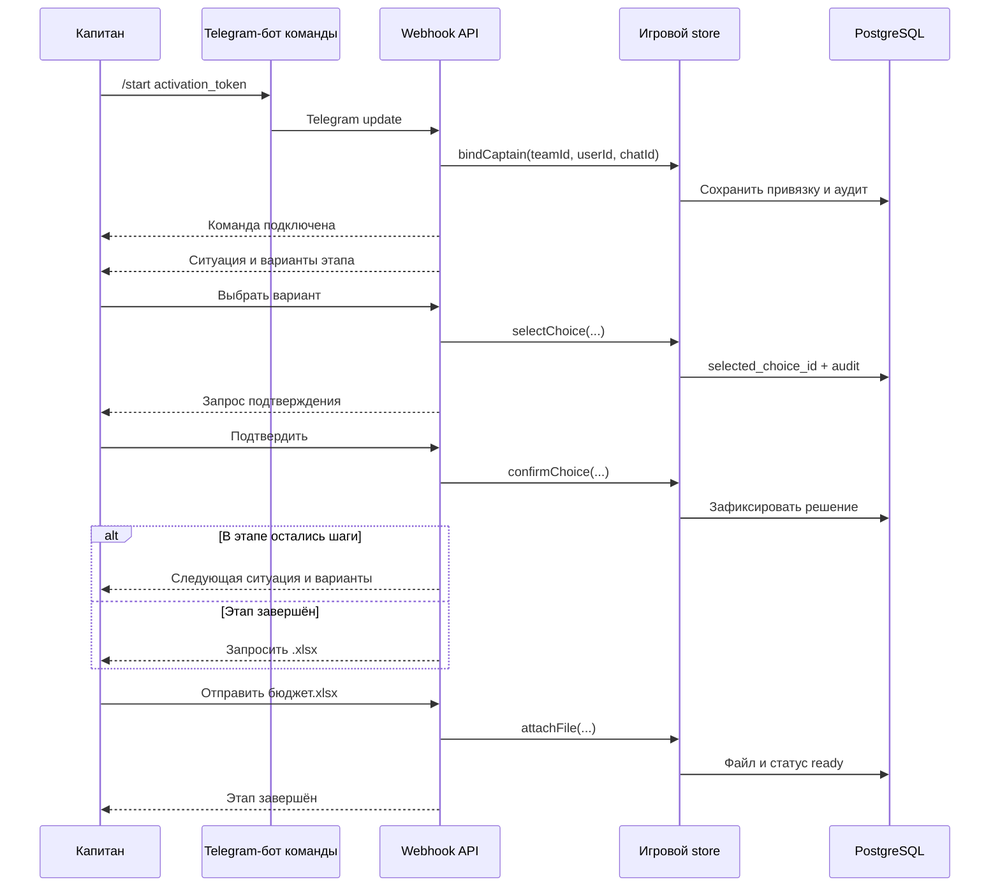
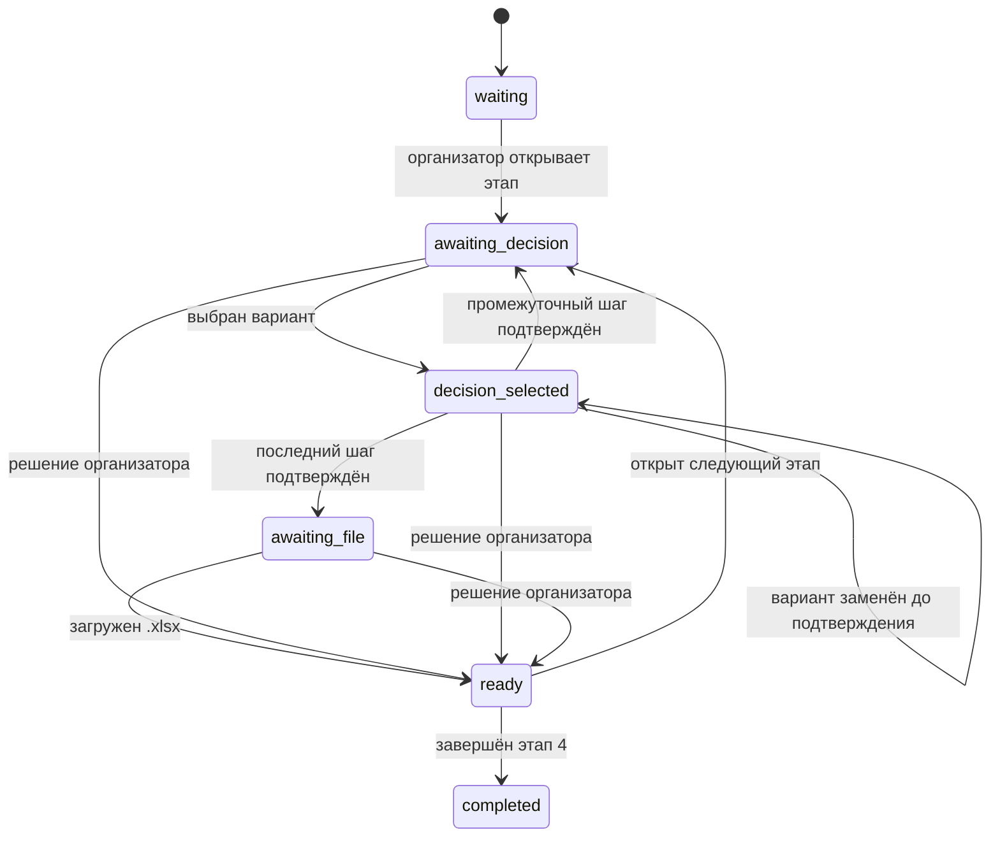
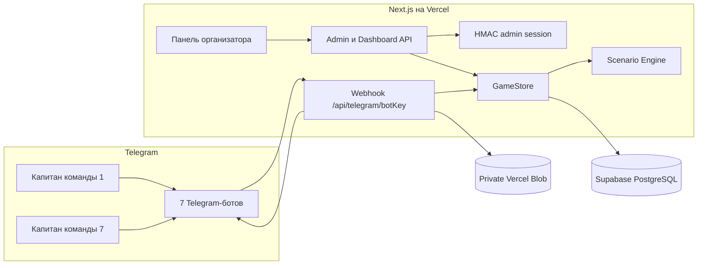

# Лига лидеров — игровая платформа для Telegram

Веб-приложение для проведения финансовой деловой игры с семью командами. У каждой команды отдельный Telegram-бот, а организатор управляет общей игровой сессией через единую защищённую панель.

- **Production:** [liga-liderov-bot.vercel.app](https://liga-liderov-bot.vercel.app)
- **Стек:** Next.js 16, React 19, TypeScript, PostgreSQL/Supabase, Telegram Bot API, Vercel Blob, Vitest
- **Версия:** 0.3.3

## Возможности

- семь заранее созданных команд и конфигураций Telegram-ботов;
- четыре красные команды со сценарием «Якорь» и три синие команды со сценарием «Шахта / Вышка / Птица»;
- персональная привязка капитана через секретный параметр Telegram deep link;
- четыре синхронных игровых этапа: начало Q1, начало Q2, начало Q3 и конец Q3;
- несколько последовательно подтверждаемых решений внутри одного глобального этапа;
- зависимость следующих ситуаций от ранее подтверждённых решений команды;
- предварительный выбор, отдельное подтверждение и необратимая фиксация решения;
- мобильное отображение длинных решений: полные формулировки перечисляются в сообщении, а кнопки сокращаются до «Вариант 1», «Вариант 2» и далее;
- обязательная загрузка актуального бюджета в `.xlsx` после подтверждения;
- общий таймер этапа с длительностью от 1 до 1440 минут;
- панель готовности семи команд, статусы доставки и журнал аудита;
- повторная отправка текущего этапа и принудительное решение организатора;
- транзакционное хранение состояния в PostgreSQL;
- дедупликация Telegram updates по паре `botKey + update_id`;
- demo-режим с памятью процесса для локальной разработки без Telegram и PostgreSQL.

## Роли

### Капитан команды

Капитан взаимодействует только со своим Telegram-ботом. Он получает ситуацию своего цвета, выбирает решение, отдельно подтверждает его и отправляет Excel-файл команды.

### Организатор

Организатор работает в веб-панели: подключает игру, задаёт время этапа, следит за командами, повторяет рассылку, фиксирует решения за отстающие команды и переводит всю игру на следующий этап.

## Пользовательский сценарий капитана

1. Организатор передаёт капитану персональную ссылку вида:

   ```text
   https://t.me/<bot_username>?start=<activation_token>
   ```

2. Капитан открывает ссылку. Webhook сверяет activation token, Telegram user ID и chat ID, после чего привязывает капитана к команде до сброса игры организатором.
3. После старта игры бот присылает заголовок этапа, описание ситуации и inline-кнопки допустимых решений.
4. Капитан нажимает вариант. На этом шаге выбор ещё можно заменить другим вариантом текущего этапа.
5. Бот показывает выбранный вариант и кнопку **«Подтвердить»**. После подтверждения изменить решение нельзя, а выбор сразу попадает в историю команды.
   Telegram callback подтверждается до записи выбора; если Telegram уже закрыл короткое окно ответа, служебная ошибка `query is too old` не показывается капитану и не отменяет корректный выбор.
6. Если внутри этапа есть следующий шаг, бот формирует его с учётом всех уже подтверждённых решений и показывает новые варианты.
7. После последнего шага бот просит отправить обновлённый бюджет. Принимается только файл `.xlsx` размером до 20 МБ.
8. После сохранения файла команда получает статус **«Готова»** и ждёт открытия следующего этапа.
9. На новом этапе бот продолжает персональную ветку команды по всей накопленной истории.



### Ошибки, которые видит капитан

- неверная или уже не подходящая ссылка активации;
- попытка действовать из Telegram-аккаунта, который не является капитаном команды;
- нажатие кнопки из карточки старого этапа;
- вариант, отсутствующий в сценарии команды;
- повторное изменение уже подтверждённого решения;
- файл не в формате `.xlsx` или больше 20 МБ.

## Сценарий организатора

1. Организатор открывает production URL и входит по `ADMIN_PASSWORD`.
2. До старта он проверяет, какие капитаны подключены. Подключение капитана возможно и после старта — бот сразу отправит ему текущий этап.
3. Организатор задаёт длительность этапа и нажимает **«Открыть первый этап»**.
4. Сервер транзакционно открывает этап для всех семи команд и рассылает разные ситуации красным и синим ботам.
5. В панели организатор видит по каждой команде:
   - подключён ли капитан;
   - выбранное решение;
   - загруженный файл;
   - результат Telegram-доставки;
   - текущий статус готовности.
6. Если сообщение не доставилось, организатор использует **«Повторить отправку этапа»**.
7. Если команда не успела, организатор выбирает допустимое решение за неё. Такое решение записывается с источником `organizer_override`; отсутствие обязательного файла также фиксируется в аудите.
8. Переход дальше разрешён только когда все семь команд имеют статус `ready`.
9. После четвёртого этапа игра получает статус `completed`.

В цепочке последних событий загрузка отображается как «Команда N загрузила файл для этапа N». Имя файла ведёт на защищённый маршрут скачивания: панель проверяет сессию организатора и отдаёт содержимое из private Vercel Blob, не раскрывая Blob-токен браузеру. Если Blob не настроен, тот же маршрут получает ранее сохранённый `file_id` через Telegram-бота команды.

Таймер информирует участников, но не переводит этап автоматически. Решение о принудительной фиксации и переходе всегда остаётся за организатором.

Карточка команды показывает подписи всех уже подтверждённых решений текущего этапа и сохраняет зелёную подсветку после загрузки Excel. Во время административной команды фоновое обновление панели приостанавливается, чтобы устаревший снимок не вернул кнопки завершённого шага. Оставшаяся открытой вкладка версии 0.2 также может отправить прежний составной вариант Q2 или прежние идентификаторы «Да/Нет» красного Q3: API преобразует их в актуальные аудируемые решения сценария 0.3.

Кнопка **«Сбросить»** завершает текущую сессию, создаёт новую ожидающую сессию и очищает привязки капитанов. Это действие следует использовать только между играми.

## Игровой сценарий

Все команды проходят четыре глобальных этапа одновременно, но получают ситуации своего цвета. Функция `getScenarioStage(team, stageIndex)` строит этап из цвета команды и её подтверждённой истории.

| Этап | Красные команды 1–4 | Синие команды 5–7 |
|---|---|---|
| 1. Начало Q1 | «Якорь» предлагает модернизацию со скидкой. Выбор между срочным наймом двух старших консультантов и подрядчиками с маржинальностью 20%. | «Шахта» просит скидку 10%. Выбор: дать скидку и начать сейчас либо сохранить ставку и принять риск переговоров. |
| 2. Начало Q2 | Два отдельных шага: чем заменить сотрудниц в декрете; затем — начинать модернизацию «Якоря» сейчас или в Q3. Последствие второго решения зависит от найма или подряда в Q1. | Три отдельных шага по проекту «Вышки»: найм двух СК, PR за 15 млн и аванс 30% бонуса продавцу. Каждый ответ подтверждается и записывается отдельно. |
| 3. Начало Q3 | «Якорь» не повышает ставки поддержки, зарплаты растут на 10%, другие клиенты повышают ставки на 5%. Команда отвечает «Да» или «Нет» на вопрос: «Вы будете что-то менять в Прогнозе года, чтобы выполнить цели Бюджета?» | Трудоёмкость и сроки «Вышки» недооценены вдвое. При остановке PR позволяет сократить рамки проекта; без PR продавец остаётся только при выплаченном авансе бонуса. При продолжении компания принимает перерасход. |
| 4. Конец Q3 | Новый клиент просит скидку 10% и не допускает подряд. После решения бот сообщает персональное последствие: загрузку нанятых в Q2 сотрудников, срочный найм либо их простой. | Бот автоматически сообщает последствия по «Вышке», продавцу и «Птице». Возможность добавить 7 млн рублей зависит от найма в Q2 и судьбы «Вышки» в Q3; после сообщения команда загружает прогноз. |

Исходная карта сценария хранится в `Ситуации для игры_final.xmind`. Исполняемая версия находится в `src/lib/scenario.ts`; интеграционный код не содержит текстов или переходов сценария.

## Состояния команды



В TypeScript этим состояниям соответствуют значения `waiting`, `awaiting-decision`, `decision-selected`, `awaiting-file`, `ready` и `completed`.

## Архитектура



### Слои приложения

| Слой | Ответственность | Основные файлы |
|---|---|---|
| UI | Панель организатора, таймер, карточки команд, команды управления | `src/components/dashboard.tsx`, `src/app/page.tsx`, `src/app/globals.css` |
| HTTP API | Авторизация, снимок панели, административные команды, Telegram webhook, health check | `src/app/api/**` |
| Сценарий | Тексты этапов, варианты, красные/синие ветки и последствия истории | `src/lib/scenario.ts` |
| Домен | Типы игры, команды, решения, доставки и аудита | `src/lib/domain/types.ts` |
| Игровой store | Правила переходов, блокировки, фиксация решений и абстракция хранения | `src/lib/store/memory.ts`, `src/lib/store/postgres.ts` |
| Интеграции | Telegram Bot API, получение файлов, Vercel Blob | `src/lib/telegram.ts` |
| Конфигурация | Семь ботов, цвета команд и env-переменные | `src/lib/config.ts` |
| Данные | PostgreSQL-схема и версионируемые миграции | `supabase/migrations/**` |

### Почему семь ботов обслуживаются одним приложением

Каждый бот имеет собственный `botKey`, token, webhook secret и activation token. Webhook имеет маршрут `/api/telegram/[botKey]`, по которому приложение находит конфигурацию и команду. После этого все боты используют один сценарный движок и один `GameStore`. Такая схема изолирует Telegram-диалоги команд, но не дублирует бизнес-логику.

### Выбор хранилища

- при наличии `DATABASE_URL` используется `PostgresGameStore`;
- без `DATABASE_URL` в development/test используется `MemoryGameStore`;
- production без `DATABASE_URL` завершается ошибкой конфигурации и не откатывается на временную память.

PostgreSQL-операции выполняются в транзакциях. Для операций над глобальной сессией используется advisory lock, а уникальный индекс допускает только одну активную сессию со статусом `waiting` или `running`.

## Модель данных

| Таблица | Назначение |
|---|---|
| `app.teams` | Семь команд, цвет, bot key и текущая привязка капитана |
| `app.scenario_versions` | Метаданные опубликованной версии сценария |
| `app.game_sessions` | Глобальное состояние игры, номер этапа, таймер и статус |
| `app.team_stage_progress` | Текущее состояние каждой команды на каждом этапе |
| `app.decisions` | Неизменяемая аудируемая запись каждого подтверждённого или принудительного шага; уникальность задаётся по сессии, команде, этапу и идентификатору шага |
| `app.file_submissions` | Версии загруженных бюджетов и ссылки на хранилище |
| `app.processed_telegram_updates` | Идемпотентность webhook по `bot_key + update_id` |
| `app.delivery_attempts` | Результаты отправки сообщений командам |
| `app.audit_events` | Хронология действий капитана, организатора и системы |
| `app.admin_commands` | Зарезервированный журнал административных команд |

## HTTP API

| Метод и путь | Доступ | Назначение |
|---|---|---|
| `POST /api/auth/login` | Публичный | Проверка пароля и создание admin-cookie |
| `POST /api/auth/logout` | Администратор | Удаление admin-cookie |
| `GET /api/dashboard` | Администратор | Текущий снимок игры, команд и аудита |
| `POST /api/admin/action` | Администратор | `start`, `advance`, `reset`, `force`, `resend` и demo-команды |
| `POST /api/telegram/[botKey]` | Telegram | Webhook конкретного бота с проверкой secret header |
| `GET /api/health/database` | Публичный | Безопасная проверка конфигурации и доступности PostgreSQL |

## Безопасность и целостность

- production-панель защищена паролем и HMAC-подписанной `HttpOnly`, `SameSite=Strict`, `Secure` cookie на 12 часов;
- Telegram webhook принимает запрос только с корректным `x-telegram-bot-api-secret-token`;
- капитан проверяется по сохранённому Telegram user ID;
- старые callback-кнопки отклоняются по номеру этапа;
- допустимость выбора проверяется по цвету команды и её истории;
- подтверждённое решение блокируется и записывается в `app.decisions`;
- повторный Telegram update не выполняется второй раз;
- секреты читаются только из переменных окружения и не должны попадать в Git;
- файлы в Vercel Blob создаются с `access: private`;
- ошибки health endpoint не раскрывают connection string или внутренний текст PostgreSQL.

## Файлы бюджетов

- разрешено только расширение `.xlsx`;
- максимальный размер — 20 МБ, что соответствует лимиту Telegram Bot API `getFile`;
- при наличии `BLOB_READ_WRITE_TOKEN` файл скачивается из Telegram и сохраняется в private Vercel Blob;
- организатор скачивает сохранённый файл по ссылке в цепочке событий; сервер повторно проверяет административную сессию и проксирует private Blob;
- без Blob-токена store сохраняет Telegram `file_id`; ссылка остаётся рабочей и получает файл через Telegram Bot API, но это не заменяет постоянное файловое хранилище.

## Локальный запуск

Требуются Node.js 24+ и pnpm 11.16+.

```bash
pnpm install
pnpm dev
```

Без `.env.local` приложение работает в demo-режиме: база и Telegram не нужны, вход организатора отключён, а на карточках команд доступны кнопки симуляции капитана.

Для настройки скопируйте `.env.example` в `.env.local`. Никогда не добавляйте `.env.local` в Git.

### Переменные окружения

| Переменная | Обязательность | Назначение |
|---|---|---|
| `ADMIN_PASSWORD` | Production | Пароль панели организатора |
| `SESSION_SECRET` | Production | HMAC-секрет административной сессии |
| `DATABASE_URL` | Production | Supabase transaction pooler для приложения |
| `DIRECT_URL` | Миграции | Прямое подключение к PostgreSQL |
| `BLOB_READ_WRITE_TOKEN` | Для постоянных файлов | Private Vercel Blob |
| `TELEGRAM_BOT_N_TOKEN` | Для каждого активного бота | Token от BotFather |
| `TELEGRAM_BOT_N_WEBHOOK_SECRET` | Для каждого активного бота | Проверка webhook |
| `TELEGRAM_BOT_N_ACTIVATION_TOKEN` | Для каждого активного бота | Персональная deep-link активация капитана |

`N` принимает значения от 1 до 7.

### Telegram webhook

Для каждого бота регистрируется отдельный URL:

```text
https://<production-domain>/api/telegram/team-N
```

При вызове Telegram `setWebhook` значение `TELEGRAM_BOT_N_WEBHOOK_SECRET` передаётся как `secret_token`.

## База данных и миграции

Миграции применяются по порядку:

1. `supabase/migrations/20260810_000001_initial_game_schema.sql`;
2. `supabase/migrations/20260811_000002_final_team_scenarios.sql`;
3. `supabase/migrations/20260811_000003_multistep_scenarios.sql`.

Третья миграция разделяет ранее сохранённые составные решения Q2 на отдельные аудируемые шаги. Поскольку она заменяет уникальность «одно решение на этап» на «одно решение на шаг», применять её и выпускать совместимый код нужно в согласованное окно, когда игровая сессия не проводится.

Для миграций используется `DIRECT_URL`; приложение и Vercel Functions используют `DATABASE_URL`. Текущие применённые миграции и production-параметры зафиксированы в `docs/vercel-project-profile.md`.

## Проверки

```bash
pnpm check
pnpm build
```

`pnpm check` последовательно запускает ESLint, TypeScript и Vitest. GitHub Actions выполняет `pnpm check` и `pnpm build` для pull request и `main`.

Live integration-тест PostgreSQL намеренно включается отдельным флагом, потому что он сбрасывает игровую сессию до и после проверки:

```powershell
Get-Content .env.local | ForEach-Object {
  if ($_ -match '^([^#=]+)=(.*)$') {
    [Environment]::SetEnvironmentVariable($matches[1], $matches[2], 'Process')
  }
}
$env:RUN_DATABASE_INTEGRATION_TESTS='1'
pnpm exec vitest run tests/postgres-store.integration.test.ts
```

## Публикация

1. Изменения создаются в отдельной ветке.
2. Открывается pull request в `main` без force push.
3. GitHub CI и Vercel Preview должны завершиться успешно.
4. Готовый PR автоматически объединяется с `main`, если пользователь явно не запретил merge.
5. Git integration запускает Vercel production deployment.
6. Релиз считается завершённым только после состояния `Ready`, проверки production alias, `/`, `/api/health/database` и защищённой панели.

Подробный профиль окружения находится в `docs/vercel-project-profile.md`.

## Структура репозитория

```text
src/app                    Next.js UI и API routes
src/components             клиентская панель организатора
src/lib/scenario.ts        сценарии красных и синих команд
src/lib/store              Memory и PostgreSQL реализации GameStore
src/lib/telegram.ts        Telegram API и обработка файлов
src/lib/domain             доменные типы
supabase/migrations        SQL-миграции
tests                      unit и integration-тесты
docs                       эксплуатационная документация
public                     статические ресурсы
```

## Исходные материалы

- `TZ_telegram_bot_finance_game.docx` — исходное техническое задание;
- `Ситуации для игры ЛЛ.xmind` — первоначальная карта ситуаций;
- `Ситуации для игры_final.xmind` — актуальный источник реализованного сценария.

## Известные ограничения

- бот не переводит этап автоматически после истечения таймера;
- без Vercel Blob содержимое Excel не переносится в постоянное файловое хранилище;
- полноценные Telegram update fixtures для всех callback/file сценариев ещё не добавлены;
- в репозитории пока нет отдельного файла лицензии: публичная доступность кода сама по себе не предоставляет дополнительных лицензионных прав.
